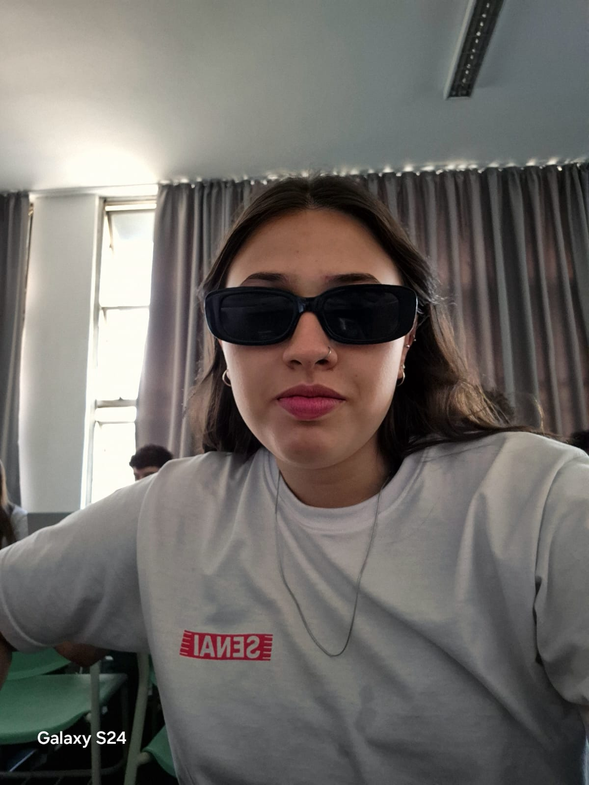

# 📝 Projeto: Lumina - Iluminando vidas

<!---Esses são exemplos. Veja https://shields.io para outras pessoas ou para personalizar este conjunto de escudos. Você pode querer incluir dependências, status do projeto e informações de licença aqui, baseado no repositorio do "iuricode"--->

> Linha adicional de texto informativo sobre o que o projeto faz. Sua introdução deve ter cerca de 2 ou 3 linhas. Não exagere, as pessoas não vão ler.

### Ajustes e melhorias

O projeto ainda está em desenvolvimento e as próximas atualizações serão voltadas nas seguintes tarefas:

- [x] Tarefa 1: desenvolver a identidade visual da empresa
- [x] Tarefa 2: realizar o levantamento de requisitos do projeto
- [x] Tarefa 3: iniciar o código
- [x] Tarefa 4: testes de projeto
- [x] Tarefa 5: projeto final

## 💻 Pré-requisitos

Antes de começar, verifique se você atendeu aos seguintes requisitos:
<!---Estes são apenas requisitos de exemplo. Adicionar, duplicar ou remover conforme necessário--->
* Você instalou a versão mais recente de `<linguagem / dependência / requeridos>`
* Você tem uma máquina `<Windows / Linux / Mac>`. Indique qual sistema operacional é compatível / não compatível.
* Você leu `<guia / link / documentação_relacionada_ao_projeto>`.

## 🚀 Instalando

Para instalar o projeto iniciar a biblioteca do React e/ou descompactar as pastas

## 🤝 Time SCRUM

Aqui está a equipe que desenvolveu este projeto:

<table>
  <tr>
      <td align="center">
      <a href="#">
         
        
          <b>Amanda Ramos</b>
        
      </a>
    </td>
    <td align="center">
      <a href="#">
         
        
          <b>Ana Peron</b>
        
      </a>
    </td>
    <td align="center">
      <a href="#">
         
        
          <b>Julia Barbosa</b>
        
      </a>
    </td>
    <td align="center">
      <a href="#">
         
        
          <b>Giovanna Oliveira</b>
        
      </a>
    </td>
  </tr>
</table>

## 🧙🏽‍♂️👩🏻‍💻 Orientadores

Agradecemos aos orientadores que contribuiram neste projeto:

<table>
  <tr>
    <td align="center">
      <a href="[#](https://br.linkedin.com/in/nadjaluz)">
         
        
          <b>Nadja Pereira Luz</b>
        
      </a>
    </td>
    <td align="center">
      <a href="[#](https://br.linkedin.com/in/raul-porto-lopes-8a866954)">
         
        
          <b>Raul Porto Lopes</b>
        
      </a>
    </td>
  </tr>
</table>
